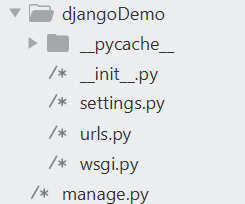
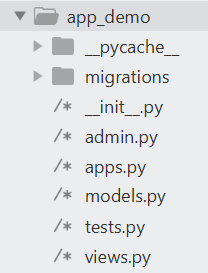

## 命令

<code>startproject</code>创建Django项目

<code>startapp</code>创建应用

<code>check</code>测试完整性

<code>runserver</code>本地运行

<code>shell君如</code>shell环境

<code>test</code>测试

(以下数据库相关)

<code>makemigrations</code>创建模型变更的迁移文件

<code>migrate</code>执行上一个命令创建的迁移文件

<code>dumpdata</code>把数据库数据导出文件

<code>loaddata</code>把文件数据导入数据库

## 创建一个简单的项目

#### 创建项目

````
django-admin startproject 项目名 
````

文件树



###### <code>settings.py</code>配置文件

````python

import os

# Build paths inside the project like this: os.path.join(BASE_DIR, ...)
# 项目的相对路径，启动服务时会运行这个文件所在路径的manage.py
BASE_DIR = os.path.dirname(os.path.dirname(os.path.abspath(__file__)))


# Quick-start development settings - unsuitable for production
# See https://docs.djangoproject.com/en/2.2/howto/deployment/checklist/

# SECURITY WARNING: keep the secret key used in production secret!
SECRET_KEY = 'gz7(l1e4&^9u4ighikqyg8tr#vw%lzc*=)i+*p=5wz3x7tf@fp'

# SECURITY WARNING: don't run with debug turned on in production!
# 是否开启DEBUG
DEBUG = True

#允许访问的主机ip，可以用通配符*
ALLOWED_HOSTS = []


# Application definition
#注册app用
INSTALLED_APPS = [
    'django.contrib.admin',
    'django.contrib.auth',
    'django.contrib.contenttypes',
    'django.contrib.sessions',
    'django.contrib.messages',
    'django.contrib.staticfiles',
   	'app_demo.apps.AppDemoConfig',#本地创建的app,apps.AppDemoConfig为app项目下的app.py的类
]

#中间件
MIDDLEWARE = [
    'django.middleware.security.SecurityMiddleware',
    'django.contrib.sessions.middleware.SessionMiddleware',
    'django.middleware.common.CommonMiddleware',
    'django.middleware.csrf.CsrfViewMiddleware',
    'django.contrib.auth.middleware.AuthenticationMiddleware',
    'django.contrib.messages.middleware.MessageMiddleware',
    'django.middleware.clickjacking.XFrameOptionsMiddleware',
]

#指定URL列表，符集URL配置
ROOT_URLCONF = 'djangoDemo.urls'

#网页模板路径
TEMPLATES = [
    {
        'BACKEND': 'django.template.backends.django.DjangoTemplates',
        'DIRS': [],
        'APP_DIRS': True,
        'OPTIONS': {
            'context_processors': [
                'django.template.context_processors.debug',
                'django.template.context_processors.request',
                'django.contrib.auth.context_processors.auth',
                'django.contrib.messages.context_processors.messages',
            ],
        },
    },
]

#WSGI的配置文件路径
WSGI_APPLICATION = 'djangoDemo.wsgi.application'


# Database
# https://docs.djangoproject.com/en/2.2/ref/settings/#databases
#数据库配置，默认为sqlite
DATABASES = {
    'default': {
        'ENGINE': 'django.db.backends.sqlite3',
        'NAME': os.path.join(BASE_DIR, 'db.sqlite3'),
    }
}


# Password validation
# https://docs.djangoproject.com/en/2.2/ref/settings/#auth-password-validators
#相关密码验证
AUTH_PASSWORD_VALIDATORS = [
    {
        'NAME': 'django.contrib.auth.password_validation.UserAttributeSimilarityValidator',
    },
    {
        'NAME': 'django.contrib.auth.password_validation.MinimumLengthValidator',
    },
    {
        'NAME': 'django.contrib.auth.password_validation.CommonPasswordValidator',
    },
    {
        'NAME': 'django.contrib.auth.password_validation.NumericPasswordValidator',
    },
]


# Internationalization
# https://docs.djangoproject.com/en/2.2/topics/i18n/

LANGUAGE_CODE = 'zh-hans'#中文

TIME_ZONE = 'Asia/Shanghai'#时区中国

USE_I18N = True

USE_L10N = True

USE_TZ = True


# Static files (CSS, JavaScript, Images)
# https://docs.djangoproject.com/en/2.2/howto/static-files/

STATIC_URL = '/static/'
````

###### <code>urls.py</code>路由文件

```python
from django.contrib import admin
from django.urls import path,include

urlpatterns = [
    path('admin/', admin.site.urls),
    path('app_demo/',include('app_demo.urls'))#转发到app下的路由设置文件,通过这个可以设置consumer和store
]

```

###### <code>wsgi.py</code>


#### 创建app

一个项目可以有多个app，且一个app可对应多个项目

````
python manage.py startapp app名
````

文件树



###### <code>admin.py</code>定义模块管理对象

###### <code>views.py</code>视图 

````python
from django.shortcuts import render
#视图，与浏览器交互
# Create your views here.
from django.http import HttpResponse
'''
该模块定义了HttpResponese对象的API
HttpResponse属性：	
	content:返回内容，字符串类型
	charset:响应的编码字符集
	status_code：HTTP相应的状态码
'''

'''
hello时一个视图函数，每个视图函数必须第一个参数为request
request是django.http.HttpResponse的一个实例
'''

def hello(request):
	return HttpResponse('Hello World')

````

**创建完视图后，要在app目录和project目录下都配置路由文件urls.py**

<code>models.py</code>定义应用模型

<code>apps.py</code>声明应用

<code>tests.py</code>编写应用测试用例

<code>urls.py</code>需要自行创建的 管理应用路由

```python
from django.urls import path,include

import app_demo.views

urlpatterns=[
	path('hello',views.hello) 
]
```

path()简介

```
path(route,view,**kwargs,name)
route 必须，路径名
view 必须，视图函数，views.py里定义
kwargs 可选，任意个关键字参数，作为一个字典传递给视图函数
name 可选，为url取名可以在Django任意地方唯一的引用
```


#### 本地运行项目

```python
python manage.py runserver [端口号]
```

在浏览器输入<code>127.0.0.1:端口号/app_demo/hello</code>

ok

#### 创建过程总结

创建项目

* 创建app
  * views.py 创建视图函数
  * urls.py 引入示图文件，设置路由
* 项目目录下的urls.py 设置路由 转发到app的路由
* 添加app到setting文件的INSTALL_APPS 
* 运行服务器
* 在浏览器打开


## 模型层

### 概念

位于Django视图层和数据库之间

负责Python对象和数据库表之间转换


屏蔽不同数据库的差异，更专注业务逻辑的开发

便捷工具有助开发

配置：在setting里的DATABASE里

### 创建模型（博客文章为例）

 ##### 定义字段

* 数字 IntegerField
* 字符串 CharField 单行较短字符串
* 文本 TextField 容量很大的字符串
* 日期 DateTimeField

  * auto_now：当对象被保存时,自动将该字段的值设置为当前时间.通常用于表示 “last-modified” 时间戳；
  * auto_now_add：当对象首次被创建时,自动将该字段的值设置为当前时间.通常用于表示对象创建时间。
* 自增ID AutoField 一个自动递增的整型字段，添加记录时它会自动增长。可以作为唯一的id以主键来使用
* BooleanField 布尔字段,管理工具里会自动将其描述为checkbox （是否选中某道菜、是否上菜
* 浮点FloatField （价格用）提供两个参数
  * *max_digits：总位数(不包括小数点和符号)*
  * decimal_places：小数位数
  * 如：要保存最大值为 999 (小数点后保存2位)，你要这样定义字段：models.FloatField(…，max_digits=5， decimal_places=2)，要保存最大值一百万(小数点后保存10位)的话，你要这样定义：models.FloatField(…，max_digits=19， decimal_places=10)I
* 图像ImageField 需要校验上传对象是否为图片，两个可选参数
  * height_field 和 width_field，如果提供这两个参数，则图片将按提供的高度和宽度规格保存。 该字段要求 Python Imaging 库
* 主键定义：primary_key属性

##### 定义一个模型

在app目录的<code>model.py</code>里定义

```python
class Article(models.Model):
	article_id=models.AutoField(primary_key=True)
	title=models.TextField()
	brief_content=models.TextField()
	content=models.TextField()
	publish_date=models.DateTimeField(auto_now=True) 
```

model设置外键

```
字段=依赖的模型名.ForeignKey(以来的字段[,on_delete=models.CASCADE/models.SET_NULL/SET_DEFAULT])
```

字段选项

````python
primary_key
unique #字段唯一
null=True/False
blank=True/False
max_length
default

choices 
用于页面上的选择框标签，需要先提供一个二维的二元元组，第一个元素表示存在数据库内真实的值，第二个表示页面上显示的具体内容。在浏览器页面上将显示第二个元素的值。例如：
class Student(models.Model):
    FRESHMAN = 'FR'#存储在数据库里值为'FR' 
    SOPHOMORE = 'SO'
    JUNIOR = 'JR'
    SENIOR = 'SR'
    YEAR_IN_SCHOOL_CHOICES = (
        (FRESHMAN, 'Freshman'),#'在页面上显示Freshman'
        (SOPHOMORE, 'Sophomore'),
        (JUNIOR, 'Junior'),
        (SENIOR, 'Senior'),
    )
 ---------上面是变量的定义，下面才是字段定义--------
    year_in_school = models.CharField(
        max_length=2,
        choices=YEAR_IN_SCHOOL_CHOICES,
        default=FRESHMAN,
    )
    
#获取choices第二元素的值的方法，get_FOO_display()方法，其中的FOO用字段名代替
>>>s=Student(year_in_school='JR')
>>>s.year_in_school
'JR'
>>>s.get_year_in_school_dispaly()
'Junior'
````


##### 创建迁移文件

```
#命令行
python manage.py makemigrations
```

app目录下的migration目录会出现一个<code>\_\_initial</code>文件

##### 运行迁移文件

```
python manage.py migrate
```

 模型啥的同步到了数据库啦


## Django Shell

 用于交互式的编程

小范围Debug

#### 使用例子(新建一个文章)

进入shell模式

```
python manage.py shell
```

新建文章，存储，查询

```python
>>>from app_demo.models import Article#导入
>>>a=Article()
>>>a.title='TEST'
>>>a.brief_content='TEST brief'
>>>a.content='TEST content'
Artivle object(None)
>>>a.save()#保存到数据库

>>>articles=Article.objects.all()#查看所有的文章
>>>article=articles[0]
>>>print(article.title)#打印文章名
TEST
```


## Django Admin模块

后台管理工具

读取定义的模型元数据，提供强大的管理使用页面，可以管理模型和模型数据


#### 使用Admin模块

##### 创建管理员用户

```
python manage.py creatsuperuser
#根据提示输入用户名、密码等
```

##### 登陆页面进行管理

把模型注册到<code>admin.py</code>

````python
from .models import Article
admin.site.register(Article)#把模型注册到admin
````

运行项目，打开admin页面，登录

可以管理用户、组、模型、对象

可以在article模型下定义函数<code>\_\_str\_\_</code>，在管理页面显示其title


## 将数据返回页面

##### <code>views.py</code>

````python
#添加
from app_demo.models import Article

def article_content(request):
	article=Article.objects.all()[0]
	title=article.title
	brief_content=article.brief_content
	content=article.content
	article_id=article.article_id
	publish_date=article.publish_date

	return_str='title:%s\nbrief_content:%s\n'\
			   'content:%s\npublish_date:%s'%(title,
			   								  brief_content,
			   								  content,
			   								  publish_date)
	return HttpResponse(return_str)
````


##### 配置路由<code>urls.py</code>

```python
from django.urls import path,include
import app_demo.views as views

urlpatterns=[
	path('hello',views.hello),
	path('content',views.article_content)#新添加的路由
]
```


## 初始Django视图与模板

### 使用Bootstrap实现静态页面

##### 页面布局设计

###### 首页

###### 详情页

##### Bootstrap以及其栅格系统

前端框架

附带源码

组件、全局CSS样式

栅格系统把页面均分为12等分(从左到右)

##### 实现静态页面

在app目录下新建一个目录<code>templates</code>

* 在templates下新建一个index.html（右键open in browser可以看效果）

  ```html
  <!DOCTYPE html>
  <html lang='en'>
  <head>
  	<meta charset="UTF-8">
  	<title>页面title</title>
  	<!-- 最新版本的 Bootstrap 核心 CSS 文件 -->
  <link rel="stylesheet" href="https://cdn.jsdelivr.net/npm/bootstrap@3.3.7/dist/css/bootstrap.min.css" integrity="sha384-BVYiiSIFeK1dGmJRAkycuHAHRg32OmUcww7on3RYdg4Va+PmSTsz/K68vbdEjh4u" crossorigin="anonymous">
  
  <!-- 最新的 Bootstrap 核心 JavaScript 文件 -->
  <script src="https://cdn.jsdelivr.net/npm/bootstrap@3.3.7/dist/js/bootstrap.min.js" integrity="sha384-Tc5IQib027qvyjSMfHjOMaLkfuWVxZxUPnCJA7l2mCWNIpG9mGCD8wGNIcPD7Txa" crossorigin="anonymous"></script>
  </head>
  <body>
  <div class="container page-header">
  	<h1>大标题
  	<small>by bdc</small>
  	</h1>
  </div>
  <div class="container page-body">
  	<div class="col-md-9 " role="main">
  		<!--col-md-9是9份的意思-->
  		<div class="body-main">
  			<div>
  				<h2>标题1</h2>
  				<p>内容</p>
  			</div>
  			<div>
  				<h2>标题2</h2>
  				<p>内容</p>
  			</div>
  		</div>
  
  	</div>
  	<div class="con-md-3" role="complementary">
  		<div>
  			<h2>最新</h2>
  			<h4><a href="#">文章1</a></h4>
  			<h4><a href="#">文章2</a></h4>
  			<h4><a href="#">文章3</a></h4>
  			<h4><a href="#">文章4</a></h4>
  			<h4><a href="#">文章5</a></h4>
  			<h4><a href="#">文章6</a></h4>
  			<h4><a href="#">文章7</a></h4>
  			<h4><a href="#">文章8</a></h4>
  			<h4><a href="#">文章9</a></h4>
  		</div>
  	</div>
  </div>
  
  </body>
  </html>
  ```

* 新建一个details页面

  ```html
  <html lang='en'>
  <head>
  	<meta charset="UTF-8">
  	<title>页面title</title>
  	<!-- 最新版本的 Bootstrap 核心 CSS 文件 -->
  <link rel="stylesheet" href="https://cdn.jsdelivr.net/npm/bootstrap@3.3.7/dist/css/bootstrap.min.css" integrity="sha384-BVYiiSIFeK1dGmJRAkycuHAHRg32OmUcww7on3RYdg4Va+PmSTsz/K68vbdEjh4u" crossorigin="anonymous">
  
  <!-- 最新的 Bootstrap 核心 JavaScript 文件 -->
  <script src="https://cdn.jsdelivr.net/npm/bootstrap@3.3.7/dist/js/bootstrap.min.js" integrity="sha384-Tc5IQib027qvyjSMfHjOMaLkfuWVxZxUPnCJA7l2mCWNIpG9mGCD8wGNIcPD7Txa" crossorigin="anonymous"></script>
  </head>
  <body>
  <div class="container page-header">
  	<h1>标题1</h1>
  </div>
  <div class="container page-body">
  		<div class="body-main">
  			<div>
  				<p>内容</p>
  			</div>
  		</div>
  
  </div>
  
  </body>
  </html>
  ```

  

### 初始Django的模板系统

视图文件不适合编码HTML，页面修改设计最好不要修改python代码

网页逻辑和网页视图应该分开设计

##### 基本语法

* 变量标签{{变量}}

  ```html
  <html><body>{{now}}</body></html>
  ```

* for循环标签 ,

  ```html
  <ul>
      
      	<li>{{item}</li>
      
  </ul>
  ```

* if-else分支标签，，

  ```html
  
  	<p>it is a true part.</p>
  
  	<p>it is a false part</p>
  
  ```

### 使用模板系统渲染博客页面

#### 首页

###### 修改<code>index.html</code>

```html
<div class="container page-body">
	<div class="col-md-9 " role="main">
		<!--col-md-9是9份的意思-->
		<div class="body-main">
			
			<div>
				<h2>{{article.title}}</h2>
				<p>{{article.brief_content}}</p>
			</div>
			
		</div>
	</div>
	<div class="con-md-3" role="complementary">
		<div>
			<h2>最新</h2>
			
			<h4><a href="#">article.title</a></h4>
			
		</div>
	</div>
</div>
```

###### 通过<code>views.py</code>得到article_list

```
#添加
def get_index_page(request):
	all_article=Article.objects.all()
	return render(request,'dynamic/index.html',#将联系起来,dynamic是建立在templates目录下的目录
				 {
				 	'article_list':all_article#把all_article传递给index.thml需要用到的artcle_list
				 }
					)
```

###### 路由配置<code>urls.py</code>

````python
urlpatterns=[
	path('hello',views.hello),
	path('content',views.article_content),
	path('index',views.get_index_page),
	path('detail',views.get_detail_page),
]
````

### 实现页面跳转、分页功能

#### 设计文章详情页URL

<code>/app_demo/detail</code>不能指定某一篇博客

可以用id来~

<code>/app_demo/detail/id</code>指定唯一ID为id的文章

#### 完善视图函数逻辑

##### 获取URL路径参数

###### <urls.py>获取

````python
urlpatterns=[
	path('hello',views.hello),
	path('content',views.article_content),
	path('index',views.get_index_page),
	#path('detail',views.get_detail_page),
	path('detail/<int:article_id>',views.get_detail_page),
]
````

##### <code>views.py下函数的修改</code>

```python

def get_detail_page(request,article_id):
	all_article=Article.objects.all()
	curr_article=None
	for article in all_article:
		if article.article_id==article_id:
			curr_article=article
			break
			
	section_list=article.content.split('\n')
	#把文章
	return render(request,'dynamic/detail.html',
				 {
				 	'curr_article':article,
				 	'section_list':section_list

				 }
					)
```

就可以看<code>http://127.0.0.1:8000/app_demo/detail/2</code>啦

#### 实现首页跳转

从首页跳转到详情页

###### 改造<code>index.html</code>，添加\<a\>标签

```html

<div class="container page-body">
	<div class="col-md-9 " role="main">
		<!--col-md-9是9份的意思-->
		<div class="body-main">
			
			<div>
				<h2><a href="detail/{{article.article_id}}">{{article.title}}</a></h2>
				<p>{{article.brief_content}}</p>
			</div>
			
		</div>
	</div>
	<div class="con-md-3" role="complementary">
		<div>
			<h2>最新</h2>
			
			<h4><a href="detail/{{article.article_id}}">{{article.title}}</a></h4>
			
		</div>
	</div>
</div>
```

#### 实现上下篇文章的跳转

###### 修改<code>detail.html</code>

去bootstrap找翻页组件复制粘贴~定义好地址

````html
<div>
	<nav aria-label="...">
  <ul class="pager">
    <li><a href="{{previous_article.article_id}}">上一篇:{{previous_article.title}}</a></li>
    <li><a href="{{next_article.article_id}}">下一篇:{{next_article.title}}</a></li>
  </ul>
</nav>
	
</div>
````

###### 修改<code>views.py</code>

```python
def get_detail_page(request,article_id):
	all_article=Article.objects.all()
	curr_article=None
	previous_index=0
	next_index=0
	previous_article=None
	next_article=None

	for index,article in enumerate(all_article):
		if index==0:
			previous_index=0
			next_index=index+1
		elif index==len(all_article)-1:
			previous_index=index-1
			next_index=index
		else:
			previous_index=index-1
			next_index=index+1

		if article.article_id==article_id:
			curr_article=article
			previous_article=all_article[previous_index]
			next_article=all_article[next_index]
			break
			

	section_list=article.content.split('\n')
	#把文章
	return render(request,'dynamic/detail.html',
				 {
				 	'curr_article':article,
				 	'section_list':section_list,
				 	'previous_article':previous_article,
				 	'next_article':next_article,

				 }
					)
```

#### 实现分页

###### 修改index.html

````html
#在page-body的div里最后添加
		<div class="body-footer">
			<div class="col-md-4 col-md-offset-3"><!--占用4列 偏移3列-->
				<nav aria-lable="Page navigation">
					<ul class="pagination">
						<li>
							<a href="" aria-label="Previous"><span aria-hidden="true">&laquo;</span></a>
						</li>
						<li><a href="">1</a></li>
						<li><a href="">2</a></li>
						<li><a href="">3</a></li>
						<li><a href="">4</a></li>
						<li><a href="">5</a></li>

					</ul>
				</nav>
			</div>
		</div>
````

###### 修改views.py来创造分页索引

<code>/app_demo/index?page=1 </code>分页为1的首页

```python
#添加在get_index_page函数下
page=request.GET.get('page')
	if page:
		page=int(page)
	else:
		page=1
```

###### 使用Django分页组件

```python
#基本演示
>>> from django.core.paginator import Paginator
>>> l=[1,2,3,4]
>>> p=Paginator(l,2)#将l进行分页，每页2个元素
>>> p.num_pages#页数
2
>>> p.count#一共多少元素
4
>>> page1=p.page(1)#获取分页1
>>> page1.object_list#查看分页1
[1, 2]
>>> page2=p.page(2)
>>> page2.object_list
[3, 4]
>>> page2.has_next()#是否有下一页
False
>>> page1.has_next()
True
>>> page2.has_previous()
True
>>>
```

在<code>view.py</code>里添加组件

````python
from django.core.paginator import Paginator#引进分页组件
def get_index_page(request):
	page=request.GET.get('page')
	if page:
		page=int(page)
	else:
		page=1

	all_article=Article.objects.all()

	paginator=Paginator(all_article,3)#分页
	page_num=paginator.num_pages

	page_article_list=paginator.page(page)

	if page_article_list.has_next():
		next_page=page+1
	else:
		next_page=page

	if page_article_list.has_previous():
		previous_page=page-1
	else:
		previous_page=page


	return render(request,'dynamic/index.html',
				 {
				 	'article_list':page_article_list,
				 	'page_num':range(1,page_num+1),
				 	'curr_page':page,
				 	'next_page':next_page,
				 	'previous_page':previous_page
				 }
					)
````

修改<code>index.html</code>

````html
<div class="body-footer">
			<div class="col-md-4 col-md-offset-3"><!--占用4列 偏移3列-->
				<nav aria-lable="Page navigation">
					<ul class="pagination">
						<li>
							<a href="?page={{previous_page}}" aria-label="Previous"><span aria-hidden="true">&laquo;</span></a>
						</li>
						
						<li><a href="?page={{num}}">{{num}}</a></li>
						
						<li>
							<a href="?page={{next_page}}" aria-label="Previous"><span aria-hidden="true">&raquo;</span></a>
						</li>
					</ul>
				</nav>
			</div>
		</div>
````

#### 实现最近五篇文章列表

###### 在<code>views.py</code>的<code>get_detail_page</code>函数添加变量

````python
top5_article_list=Article.objects.order_by('-publish_date')[:5]#-publish_date表示逆序
#排序函数，可以根据这个思路给一个热门菜推荐？
return render(request,'dynamic/index.html',
				 {
				 	'article_list':page_article_list,
				 	'page_num':range(1,page_num+1),
				 	'curr_page':page,
				 	'next_page':next_page,
				 	'previous_page':previous_page
				 	'top5_article_list':top5_article_list#新增变量
				 }
					)
````

###### 修改<code>index.html</code>

````
把最新文章的迭代对象改为top5_article_list
````


